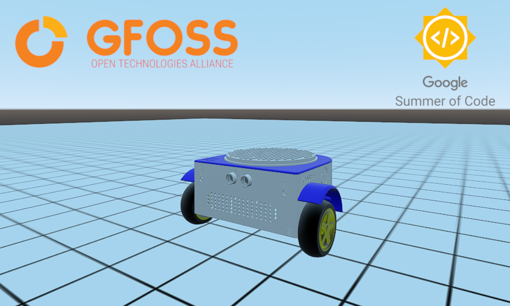

# :robot: GSOC 2023 - Web Based robotic simulator for the DIY robot kit for educators



## Introduction

This project introduces a web-based fossbot simulator developed using the open-source game engine [Godot 3.5.2](https://godotengine.org/). It incorporates all methods available in the fossbot interface, which can be found in the corresponding section of this [wiki](https://github.com/chronis10/fossbot-source/wiki). Additionally, it introduces new features, such as the ability to control multiple fossbots and dynamically alter the environment's obstacle terrain. This enhanced simulator offers an immersive platform for comprehensive testing and simulation of fossbot capabilities.

Communication within the simulator relies on SocketIO with rooms, supported by a Flask-SocketIO server, which I developed. To run this web simulator, I have also implemented both Python and JavaScript libraries. To learn more about the Python library, you can explore the relevant [wiki](https://github.com/chronis10/fossbot-source/wiki). For information on the JavaScript library, please refer to the corresponding section of this [wiki](https://github.com/eellak/fossbot-web-simulator/wiki).


[View the project on Google Summer of Code website](https://summerofcode.withgoogle.com/programs/2023/projects/xsxF9klm).

You can see the detailed timeline [here](gsoc-timeline.md).


### Fossbot web simulator showcase video

[](https://youtu.be/PzgRiEij-f4 "")

Final Report
------------

You can visit this [gist](https://gist.github.com/manouslinard/29b2decf4b88e6e0919c81c993969ba0) that summarizes in a few words, the work which was done during the Google Summer of Code working period.


Synopsis
--------

This project offers the capability to run and thoroughly test all functions of the fossbot (which can be found in the corresponding section of thiw [wiki](https://github.com/chronis10/fossbot-source/wiki)). Furthermore, it facilitates dynamic level creation using JSON messages available in the Python library. The process to test the simulator **locally** involves the following steps:

1. Familiarize yourself with the [web simulator documentation](https://github.com/eellak/fossbot-web-simulator/wiki).
2. Install the [godot fossbot library](https://github.com/chronis10/fossbot-source) and refer to its [documentation](https://github.com/chronis10/fossbot-source/wiki).
3. Launch the server by executing the command below (from the `exports` directory of [current repository](https://github.com/eellak/fossbot-web-simulator)):
```bash
python3 server.py
```
4. Open http://localhost:8000/godot or http://localhost:8000/godotcode in your web browser.
5. Copy the session ID.
6. Run the simulator using the fossbot godot library in Python (if connected to /godot) or directly from the browser (if connected to /godotcode).


Challenges and Solutions
--------

One of the central challenges encountered during the project was the creation of the fossbot model from scratch. Although Godot does not inherently restrict vehicles to only four wheels, implementing a three-wheel vehicle proved intricate challenge. To ensure precise and realistic fossbot movements, I devised custom methods to adapt the model's center and exhaustively tested various options for optimal results.

Additionally, crafting accurate representations of each robotic component (like ultrasonic sensor, line sensor and light sensor) for the fossbot from scratch posed another significant challenge. I meticulously matched these virtual parts to their real-world counterparts, aiming for authenticity and flawless functionality within the simulation.

Addressing the complexities of the socketio server presented another hurdle. To ensure seamless message routing without message conflicts in multiple fossbot scenarios, I conceived a message distributor within the simulation, effectively utilizing socketio's capabilities.

Furthermore, devising a **dynamic** level generation process encompassing obstacles, terrain, and image integration onto the floor also demanded innovative problem-solving techniques.


GSoC Deliverables
------------

1. Fossbot Model Implementation
2. Robotic Component Integration in Godot
3. Multiple Fossbot Message Routing Mechanism
4. Advanced Level Generation System
5. Flask-Socketio Server Development
6. Web Simulator Frontend Design
7. Expansion of [fossbot's source library](https://github.com/chronis10/fossbot-source)
8. Development of JavaScript Library for Fossbot
9. Comprehensive Usage Documentation


Future Work
------------

There are still opportunities for further enhancement of the Fossbot Web Simulator. I am confident that, with the combined efforts of the Open Source community, this goal can be achieved. Feel free, to contribute and participate on that project, any suggestion and improvement are welcomed.

Some thoughts for future work:

1. Enhance Fossbot Model in Godot
2. Refine Terrain Generation
3. Diversify Preset Levels
4. Extend JavaScript Library
5. Extend Python Godot Library for AI Training

### Student

* [Manousos Linardakis](https://github.com/manouslinard)

### GSoC Mentors

* [Iraklis Varlamis](https://github.com/varlamis)
* [Christos Chronis](https://github.com/chronis10)

### Organization :  Open Technologies Alliance - GFOSS 

[MIT License](https://github.com/eellak/fossbot-web-simulator/blob/main/LICENSE)
